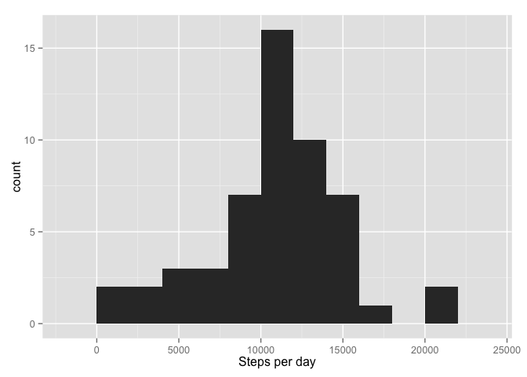
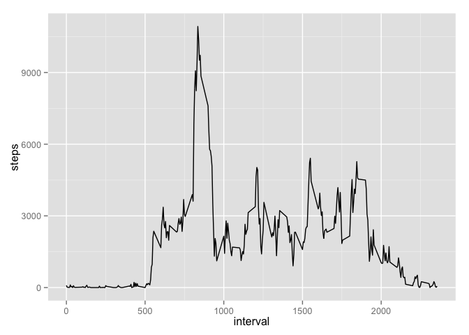
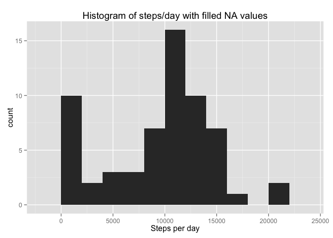
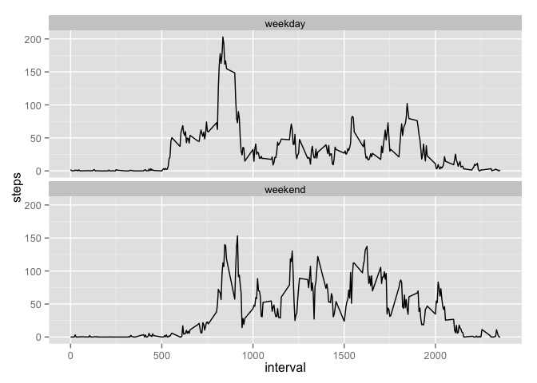

# Reproducible Research: Peer Assessment 1


## Loading and preprocessing the data

```r
suppressPackageStartupMessages(library(dplyr))
if(file.exists("activity.zip")){
    unzip("activity.zip");
    df = data.frame(read.csv("activity.csv"));
}else{
    temp <- tempfile("activity.zip");
    download.file("https://d396qusza40orc.cloudfront.net/repdata%2Fdata%2Factivity.zip",destfile = "activity.zip", method = "curl");
    unzip("activity.zip");
    unlink(temp);
    df = data.frame(read.csv("activity.csv"));
}

df = mutate(df, date = as.Date(date, format = '%Y-%m-%d'));
head(df);
```

```
##   steps       date interval
## 1    NA 2012-10-01        0
## 2    NA 2012-10-01        5
## 3    NA 2012-10-01       10
## 4    NA 2012-10-01       15
## 5    NA 2012-10-01       20
## 6    NA 2012-10-01       25
```


## What is mean total number of steps taken per day?

```r
suppressPackageStartupMessages(library(ggplot2))

steps_per_day = df %>% filter(complete.cases(steps)) %>% group_by(date) %>% summarise(steps=sum(steps))

breaks <- pretty(range(steps_per_day$steps), n = nclass.FD(steps_per_day$steps), min.n = 1)
bwidth <- breaks[2]-breaks[1]
qplot(data=steps_per_day, steps, xlab="Steps per day", binwidth = bwidth)
```

 

```r
mean = steps_per_day %>% summarise(mean(steps))
median = steps_per_day %>% summarise(median(steps))
mean
```

```
## Source: local data frame [1 x 1]
## 
##   mean(steps)
##         (dbl)
## 1    10766.19
```

```r
median
```

```
## Source: local data frame [1 x 1]
## 
##   median(steps)
##           (int)
## 1         10765
```


## What is the average daily activity pattern?

```r
grouped_interval <- df %>% filter(complete.cases(steps)) %>% group_by(interval) %>% summarise(steps=sum(steps))

head(grouped_interval)
```

```
## Source: local data frame [6 x 2]
## 
##   interval steps
##      (int) (int)
## 1        0    91
## 2        5    18
## 3       10     7
## 4       15     8
## 5       20     4
## 6       25   111
```

```r
ggplot(data=grouped_interval, aes(x=interval, y=steps, group=1)) + geom_line()
```

 

```r
interval_with_max_steps <- grouped_interval %>% arrange(desc(steps)) %>% top_n(1)
```

```
## Selecting by steps
```

```r
interval_with_max_steps
```

```
## Source: local data frame [1 x 2]
## 
##   interval steps
##      (int) (int)
## 1      835 10927
```

## Imputing missing values

```r
#the number of missing values
dim(df %>% filter(is.na(steps)))[1]
```

```
## [1] 2304
```

```r
# calculate the average steps per day while replacing the ones whith missing values
avg_steps_per_day <- (df %>% mutate(steps = ifelse(is.na(steps), 0, steps)) 
                      %>% group_by(date) 
                      %>% summarise( steps=round(mean(steps)) )
)

df_filled_steps <- df


for(i in 1:nrow(df_filled_steps)) {
  date <- df_filled_steps[i, "date"]
  steps <- df_filled_steps[i, "steps"]
  if(is.na(steps)){
    df_filled_steps[i, "steps"]<-avg_steps_per_day[avg_steps_per_day$date == date, "steps"]
  }
}

steps_per_day_filled_na = df_filled_steps %>% group_by(date) %>% summarise(steps=sum(steps))

qplot(data=steps_per_day_filled_na, steps, xlab="Steps per day", binwidth = bwidth) + labs(title="Histogram of steps/day with filled NA values");
```

 

```r
mean_filled_na = steps_per_day_filled_na %>% summarise(mean(steps));
median_filled_na = steps_per_day_filled_na %>% summarise(median(steps))

mean_filled_na
```

```
## Source: local data frame [1 x 1]
## 
##   mean(steps)
##         (dbl)
## 1     9354.23
```

```r
median_filled_na
```

```
## Source: local data frame [1 x 1]
## 
##   median(steps)
##           (dbl)
## 1         10395
```


## Are there differences in activity patterns between weekdays and weekends?


```r
week_days=c("Monday", "Tuesday", "Wednesday", "Thursday", "Friday")

df_filled_steps <- (
        df_filled_steps %>% 
          mutate(day=as.factor(
              ifelse(weekdays(date) %in% week_days, "weekday", "weekend")
            )
          )
)

grouped_interval_filled_steps <- df_filled_steps %>% group_by(interval, day)
weekdays <- grouped_interval_filled_steps  %>% filter(day=="weekday") %>% summarise(steps=mean(steps))
weekends <- grouped_interval_filled_steps  %>% filter(day=="weekend") %>% summarise(steps=mean(steps))
grouped_interval_filled_steps <- bind_rows(weekdays, weekends)

head(grouped_interval_filled_steps)
```

```
## Source: local data frame [6 x 3]
## 
##   interval     day      steps
##      (int)  (fctr)      (dbl)
## 1        0 weekday 2.02222222
## 2        5 weekday 0.40000000
## 3       10 weekday 0.15555556
## 4       15 weekday 0.17777778
## 5       20 weekday 0.08888889
## 6       25 weekday 1.31111111
```

```r
ggplot(data=grouped_interval_filled_steps, aes(x=interval, y=steps)) + geom_line() +facet_wrap(~day, nrow=2)
```

 

